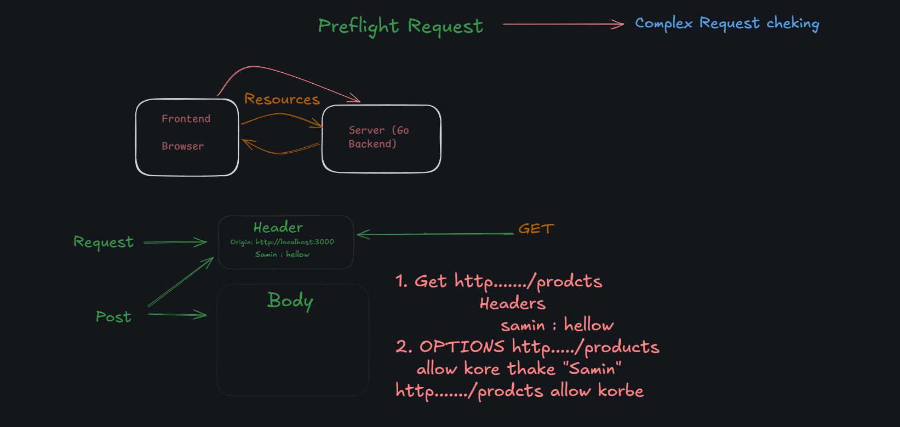

https://pkg.go.dev/net/http#ServeMux.Handle

https://github.com/vipullsingh/product-listing-react

**go mod init your-module-name**

REST stands for Representational State Transfer.  
Options => Preflight Req 

SOLID fomrate =>
S = single responsible principle (1 ta func 1ta kaj)
O: Open/Closed Principle (OCP)
L: Liskov Substitution Principle (LSP)
I: Interface Segregation Principle (ISP)
D: Dependency Inversion Principle (DIP)

inception => newtork part status checking 

37:44
